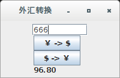
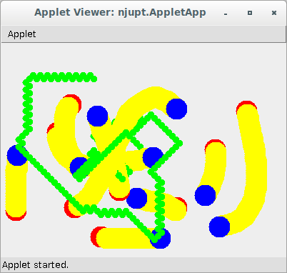
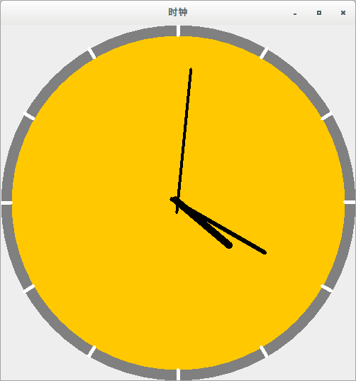

# JavaExperiments  
南邮Java课程实验，  
  
## exchange  
2016/2017 学年第2学期《JAVA程序设计》课程第1次实验 （B150404-06）  
实验名称： 综合图形界面程序设计  
实验环境：PC微型计算机系统,Microsoft Windows操作系统,SUN Java Development Kit开发工具包，NetBeans开发工具。  
 实验目的和要求：学习和理解JAVA SWING中的容器，部件，布局管理器和部件事件处理方法。通过编写和调试程序，掌握JAVA图形界面程序设计的基本方法。  
 实验内容：设计和编写一个用于将人民币转换为等值的美元的程序，界面要求可以输入人民币的金额并可以得到转换后的结果。  
 附：程序使用的人民币外汇牌价参考  
每100元美元等值买入人民币数：688.00 (2016/12/6 数据)  
 实验时间：2学时  
(课内时间)  
B150404,B150405,B150406: 第15周 周5 (2017/6/2)上午1/2节课(原来的上课时间) 2学时  
实验地点：计算机学科楼 405，407。(如有调整具体见实验室布告栏)  
 实验要求写出实验报告，请领取并使用统一格式的实验报告，实验报告计入课程的平时成绩，请认真完成并在规定的时间提交（具体课堂通知）。  

## applet
2016/2017 学年第2学期《JAVA程序设计》课程第2次实验（B150404-06）  
实验名称： 小应用程序Applet设计  
实验环境：PC微型计算机系统,Microsoft Windows操作系统,SUN Java Development Kit开发工具包，NetBeans开发工具。  
 实验目的和要求：要求学生能在学习和理解课堂学习内容中JAVA小应用程序的基础上，通过实验，培养学生将JAVA小应用程序相关知识点（包括JAVA Applet和低级事件处理模型）有机结合，设计基于WEB浏览器的小应用程序的能力。  
 实验内容：设计和编写一个可以用鼠标操作的Applet小应用程序和相应的HTML页面，观察Applet的执行过程，测试程序鼠标用户交互操作的效果。  
 实验时间：2学时  
(课内时间)  
B150404,B150405,B150406: 第17周 周3 (2017/6/14)下午6/7节课(原来的上课时间) 2学时  
 实验地点：  
计算机学科楼401，403。(如有调整具体见实验室布告栏)  
实验要求写出实验报告，请领取并使用统一格式的实验报告，实验报告计入课程的平时成绩，请认真完成并在规定的时间提交（具体课堂通知）。  

鼠标点击拖动都会在面板上留下痕迹，  
同时一个线程自动在面板上画绿色小圆点跟踪鼠标，  
并随applet的start启动，stop停止，  

## stream
2016/2017 学年第2学期《JAVA程序设计》课程第3次实验（B150404-06）  
实验名称： 流处理程序设计  
实验环境：PC微型计算机系统,Microsoft Windows操作系统,SUN Java Development Kit开发工具包，NetBeans开发工具。  
 实验目的和要求：要求学生能在学习和理解课堂学习内容中JAVA流编程理论的基础上，学习并逐步掌握JAVA流程序的编写和调试，学习根据处理需求对不同流的正确选择使用和组合使用方法。  
 实验内容：设计和编写一个程序从键盘读入一行字符串，将其写入一个文本文件中，再编写另一个程序从文本文件中读入字符串并在命令行窗口显示出来。  
 实验时间：2学时  
(课内时间)  
B150404,B150405,B150406: 第17周 周5 (2017/6/16)上午1/2节课(原来的上课时间) 2学时  
 实验地点：  
计算机学科楼401，403。(如有调整具体见实验室布告栏)  
 实验要求写出实验报告，请领取并使用统一格式的实验报告，实验报告计入课程的平时成绩，请认真完成并在规定的时间提交（具体课堂通知）。  

文件保存在系统临时目录下的njupt.txt,  

## thread
2016/2017学年第2学期《JAVA程序设计》课程第4次实验（B150404-06）  
实验名称： 线程程序设计  
 实验环境：PC微型计算机系统,Microsoft Windows操作系统,SUN Java Development Kit开发工具包，NetBeans开发工具。  
 实验目的和要求：本实验旨在通过实验，培养学生将JAVA 线程的相关知识点（包括线程调度，线程同步等）有机结合并加以综合应用，在实验中设计多线程程序的能力。  
 实验内容：设计和编写一个编写一个指针式时钟程序，应用线程实现时钟的走动。  
实验时间：2学时  
(课内时间)  
B150404,B150406,B150407: 第18周 周5 (2017/6/23)上午1/2节课(原来的上课时间) 2学时  
 实验地点：  
计算机学科楼405，407。(如有调整具体见实验室布告栏)  
 实验要求写出实验报告，请领取并使用统一格式的实验报告，实验报告计入课程的平时成绩，请认真完成并在规定的时间提交（具体课堂通知）。  

精确到毫秒，每100毫秒刷新一次，每次秒针都会移动，

